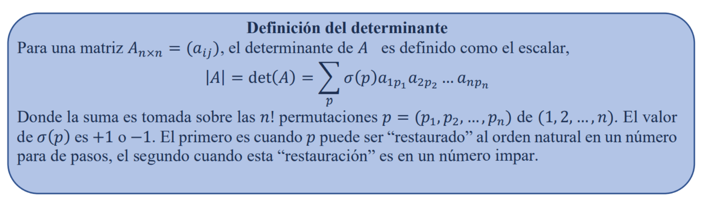

# Determinante de una matriz
## Instrucciones:
- Descargue toda la carpeta o haga un pull hasta su computadora.
- Una vez tenga sus arcvhivos en su computadora siga los siguientes pasos:
- Escriba por favor, en un archivo llamado `Matrix.txt`, las matrices a tratar, pueden ser muchas, las que usted quiera, cada fila separada por un salto de línea y cada columna separada con espacios, además, cada matriz separada por dos saltos de línea, a continuación un ejemplo:

```python
1 2 3
4 5 6
7 8 9

1 2
5 6

5 8 1 6 7 5
4 3 5 7 3 1
3 2 4 3 4 4
5 0 2 0 3 9
9 5 4 1 8 1
2 6 4 4 1 1
```
- Abra el archivo ``Matrix_Determinant_Calculator.ipynb`` (Note que necesita jupyter notebook).
- Corra por favor, todas las celdas, note que las celdas que dan la respuesta están justo debajo de los títulos _"Calcular Determinante"_.

- Se creará un archivo llamado: `Determinants.txt` las determinantes de cada matrix dada, de igual forma las soluciones apareceran en el output de la celda o en la línea de comandos, depende de donde se ejecute el código.

## Consideraciones:
Solo funciona con Sistemas Lineales cuadrados, es decir, aquellos que tienen dimension $nxn$

## Procedimiento
El método para resolver este sistema es el siguiente:
